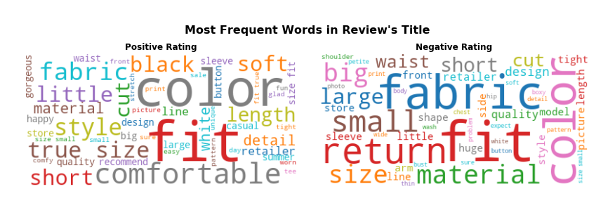

# Topic Modeling Customers' Text Reviews on Women Clothings
## *What does customers complain about the product?*

## Overview
This project aims to **extract meaning from customer' text reviews** to identify what issues that customers dislike on a particular product. Retailers can use the insights to prioritize improvement on the most frequently complaining issues. The model produces a probability weights coresponding to each buckets of issues for each negative review text (a negative review text in this analysis is defined as low rating lower than 3 in a scale of 5). Out of the **k** buckets of issues extracted from the model, each text will be assigned an issue that have the highest probability weight.

I use topic modeling techniques using Latent Dirichlet Analysis LDA. Ultimately, validating unsupervising model is extreme difficult, especially in the NLP. Current evaluations of topical quality rely heavily on experts eaminations, i.e. human eyes validation involved. Based on human reading and validation, this model achieved 57% accuracy, and 77% accuracy on 90% percentile of probability weight. This performance is due to the model's inability to 'understand' the ironicallity and different style of different customers, and such a narrow subjects of this dataset, making it challenging to avoid topical overlap.

Further improvement areas includes a significant amount of revision: modifying the vocabulary to include acronyms and multi-word phrases, removing nonsensical topics, conducting parameter search, and comparing with other models.

### Business Questions
There are many possible exploratory text analysis, supervised and unsupervised model techiniques on this dataset. Some business questions in scope of this analysis are:

1. Based on review and rating, what do customers like and dislike about a clothing item?
Solutions: descriptive statistics.
2. Are there any difference between **category** and **department**?
Solutions: Bag of words, Wordcloud visualization.

3. How to **prioritize which issue for improvement** for a clothing item?
Solution: Topic modeling using LDA on text reviews.

4. How to choose which **PRODUCT** to improve first?
Solution: Rating statistics, LDA output model accuracy (more accurate prediction is prioritized)

### High Level Approach

### Data Sourcing
This is a Kaggle dataset. Link: https://www.kaggle.com/nicapotato/womens-ecommerce-clothing-reviews:

This dataset includes **23486 rows and 10 feature variables**. Each row corresponds to a customer review, and includes the variables:
 Column Name | Description |
|-|-|
|1. Clothing ID| Integer Categorical variable that refers to the specific piece being reviewed.
|2. Age| Positive Integer variable of the reviewers age.
|3. Title| String variable for the title of the review.
|4. Review Text| String variable for the review body.
|5. Rating| Positive Ordinal Integer variable for the product score granted by the customer from 1 Worst, to 5 Best.
|6. Recommended IND| Binary variable stating where the customer recommends the product where 1 is recommended, 0 is not recommended.
|7. Positive Feedback Count| Positive Integer documenting the number of other customers who found this review positive.
|8. Division Name| Categorical name of the product high level division.
|9. Department Name| Categorical name of the product department name.
|10. Class Name| Categorical name of the product class name.

### Data Understanding
https://nbviewer.jupyter.org/github/loandangnt/women-clothing/blob/master/women_clothing_data_exploration.ipynb

#### 1. Based on review and rating, what do customers like and dislike about a clothing item?

Both groups care some common area, such as how the item fit the body, the color of the clothes, if size is as expected, the material and fabric quality, other details of the item (sleeve, waist, arm, button, chest, hip).

There are interesting pattern in the negative reviews, compared to the positive ones:
- The word **small, fabric, material** seems to be more common issues in negative texts than in positive ones. These are things that easily let people down when they receive the item bought.

- The word **expect, picture, photo** appear in the negative groups. This means the gap between what they expect from the information online and what they actually experience when receiving the item was large enough to let they down. No matter what the issues are, retailers should provide information (size, product infor, real images) that match as much as possible to avoid disatisfaction. This is a common pitfall of apparel e-commerce. Customers are ultimately attracted to gorgeous images with good price online and make purchase, but then they leave bad comments and never come back. This actually the worst for any retailers who want to build long-term business. 

There are overlaped words between positive reviews and negative reviews. Out of total **5460** words in cleaned negative reviews, there are **3861** words overlap with those in cleaned positive reviews (**70.7%**). The bar charts also show that **both customers who are satisfied and not satisfied with the bought item care** about certain aspects, such as the fit, size, color, fabric, etc.

This insight strenthens my aprroach to dive depper into only the negative reviews and analyze if there are any cluster of issues (groups of issues) that seller can improve their product. Learning and improving from failures has been a good approach to compete in the market.

Therefore, my next step of the analysis is the topic modeling task using Latent Class Allocation LDA and Semantic Class Analysis. I then decide which model yields the most quality topics and map the model result back to the original dataframe.

#### 2. Are there any difference in rating and customers' preferences between category and department?

There are interesting differences in rating statistics between different clothing classes. There are interesting differences in rating statistics between different clothing classes. 

- Group 1: Classes in **Dresses** and **Tops** are the most frequently bought and also received a large number of bad reviews. That was why rating average of these classes/departments are lower than overall rating average (lower than 4.19, except *Fine Gauge*). They are big bubbles on the lower right corner of the above graph.

- Group 2: **Bottoms** products including *Jeans, Pants, Shorts, Skirts*, and **Intimate** products including *Layering and Lounge* have higher average rating, and lower rating standard deviation. This is understandable because they have smaller customer base, thus, smaller range of opinions than the first group.

- Group 3: The third group are small classes that have high rating average and high rating standard deviation. They are **Jackets** and **Intimates, Sleep, Legwear**. As they have very small number of reviews, rating values can be influenced by some extreme opinions and vary more than other classes.

Rating pattern in differs between different classes. This pattern confirms the differences in rating statistics (MEAN of rating, STANDARD DEVIATION of rating) between classes in the bubble chart.

Knowing which classes perform worse and which are better is only one part of the journey. Noting this diffent, it is worth to look at customer insights into each classes of clothing. Customer insights derived from review texts (especially in negative reviews).

The goal is to address what make the difference, i.e. where the issues are. Which products within lesser performers contribute the most the overall statistics, and what are wrong with those products. Again, the topic modeling applied to each review item can help answer the questions.

### LDA Topic Modeling
#### Data Pre-processing
#### Modeling
#### Choosing optimal k number of topics
#### Model output visualization
#### Model output evaluation
 
### Apply LDA Model Result
#### *How to choose which product to adress first?*
### Conclusion

### Next Steps
