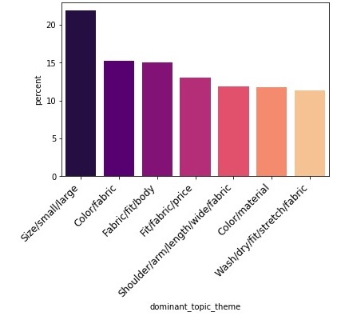
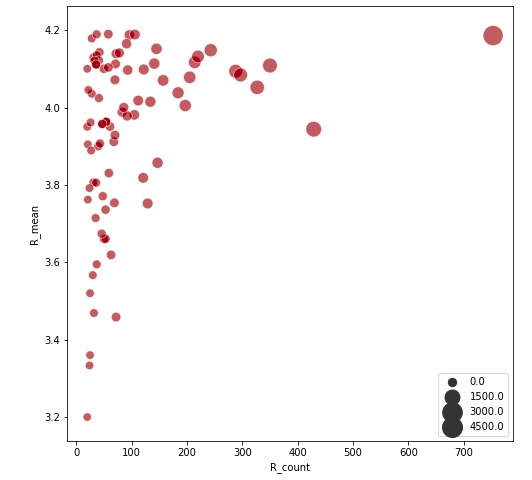

# Topic Modeling Customers' Text Reviews on Women Clothings
## *What does customers complain about the product?*

## Overview
This project aims to **extract meaning from customer' text reviews** to identify what issues that customers dislike on a particular product. Retailers can use the insights to prioritize improvement on the most frequently complaining issues. 

The model produces a probability weight map coresponding to buckets of issue **for each negative review text** (a negative review text in this analysis is defined as low rating lower than 3 in a scale of 5). Out of the **k buckets** of issues extracted from the model, each text will be assigned an *issue* that have the **highest probability weight**.

I run 2 most popular used topic modeling algorithm and choose Latent Dirichlet Allocation (LDA) as the best quality model for this analysis. Ultimately, validating unsupervising model is extreme difficult, especially in NLP. Current evaluations of topical quality rely heavily on experts eaminations, i.e. human eyes validation involved. Based on human reading and validation, this model achieved 57% accuracy, and 77% accuracy on 90% percentile of probability weight. This performance is due to the model's inability to 'understand' the ironicallity and different style of languege expression of different customers, as well as such a narrow subject of this dataset, making it challenging to avoid topical overlapping.

### Business Questions
There are many possible exploratory text analysis, supervised and unsupervised model techiniques on this dataset. Some business questions in scope of this analysis are:

1. Based on review and rating, what do customers **like and dislike** about a clothing item?
Solutions: descriptive statistics.

2. Regarding the above preferences, are there any difference between **category** and **department**?
Solutions: Bag of words, Wordcloud visualization.

3. How to **prioritize which issue for improvement** for a clothing item?
Solution: Topic modeling using LDA on text reviews.

4. How to choose which **product** to improve first?
Solution: Rating statistics, LDA output model accuracy (more accurate prediction is prioritized)

### High Level Approach
**1. Data Preprocessing**:
- Clean: remove unused characters/words (punctuations, tag, special characters and digits, stopwords)
- Tokenize: split text sentences into single words.
- POS tag (an intermediate step to include only types of words that are needed, which are NOUN, VERB, ADJ)
- Lemmatize: changes variation of words into its root (e.g. *go, went, gone, going* into *go*).

**2. Data Exploratory Analysis**: answer the first two business questions in the Business Question section above and to give an idea why the topic modeling task could be valuable.

**3. Data Modeling**

**4. Model Evaluation and Selection**

**5. Business Application of Model Output**

### Data Sourcing
This is a Kaggle dataset. Link: https://www.kaggle.com/nicapotato/womens-ecommerce-clothing-reviews:

This dataset includes **23486 rows and 10 feature variables**. Each row corresponds to a customer review, and includes the variables:
 Column Name | Description |
|-|-|
|1. Clothing ID| Integer Categorical variable that refers to the specific piece being reviewed.
|2. Age| Positive Integer variable of the reviewers age.
|3. Title| String variable for the title of the review.
|4. Review Text| String variable for the review body.
|5. Rating| Positive Ordinal Integer variable for the product score granted by the customer from 1 Worst, to 5 Best.
|6. Recommended IND| Binary variable stating where the customer recommends the product where 1 is recommended, 0 is not recommended.
|7. Positive Feedback Count| Positive Integer documenting the number of other customers who found this review positive.
|8. Division Name| Categorical name of the product high level division.
|9. Department Name| Categorical name of the product department name.
|10. Class Name| Categorical name of the product class name.

### Data Exploratory Analysis
https://nbviewer.jupyter.org/github/loandangnt/women-clothing/blob/master/women_clothing_data_exploration.ipynb

#### 1. Based on review and rating, what do customers like and dislike about a clothing item?

From the visuals, we can see that people generally don't mention what make them like. They only express the **general look** or **how it feels** in general. For example, top words in **positive reviews** are *gorgegous, comfortable, comfy, fit, soft*.

In contrast, **negative reviews** mention directly in the Title what make the buyers disatisfied with their purchase. Top keywords are largely about **fit, small, large, fabric, color, quality, etc.**

In addition, the word **picture, expect** appear in the top 50 common words. This means the gap between **what buyers expected** from the information online and **what they actually experienced** when receiving the item was large enough to make they so disappointed.

Given this insight, retailers are better provide precise information including *sizing information, product details, real images* that matches as much as possible to the reality to avoid disatisfaction. This is a common challenge in the apparel e-commerce industry. THe problem is that customers are ultimately attracted to gorgeous images online. They make purchase and get disappointed, then, leave negative comments and are likely to never come back! This actually the worst for any retailers who want to build a long-term business.

So, let's take a look at the Review Text field to analyze more details.

There are overlaped words between positive reviews and negative reviews. Out of total **5,460** words in cleaned negative reviews, there are **3,861** words overlap with those in cleaned positive reviews (**70.7%**). Let's take a closer look at the overlapping issue.

Both groups care about some common areas, such as how the they **fit, color, size, material, fabric**, and other details of the clothing item including **sleeve, waist, arm, button, chest, and hip**.

Another interesting pattern in the negative reviews is that the word **small, fabric, material** seems to be more common issues in negative texts than in positive ones. These are things that easily let people down when they receive the items.

These insights strenthen my aprroach to dive depper into only the negative reviews and analyze if there are any cluster of issues (groups of issues) that seller can improve their products. Learning and improving from failures has been a good approach to increase customer satisfaction, and compete in the marketplace.

Therefore, my next step of the analysis is the topic modeling task using Latent Class Allocation LDA and Semantic Class Analysis. I then decide which model yields the most quality topics and map the model result back to the original dataset.

#### 2. Are there any difference in rating and customers' preferences between category and department?

There are interesting differences in rating statistics between clothing classes:

- Group 1: Classes in **Dresses** and **Tops** are the most frequently bought and also received a large number of bad reviews. That was why rating average of these classes/departments are lower than overall rating average (lower than 4.19, except *Fine Gauge*). They are big bubbles on the lower right corner of the above graph.

- Group 2: **Bottoms** products including *Jeans, Pants, Shorts, Skirts*, and **Intimate** products including *Layering and Lounge* have higher average rating, and lower rating standard deviation. This is understandable because they have smaller customer base, thus, smaller range of opinions than the first group.

- Group 3: The third group are small classes that have high rating average and high rating standard deviation. They are **Jackets** and **Intimate** products including *Intimates, Sleep, Legwear*. As they have very small number of reviews, rating values can be influenced by some extreme opinions and vary more than other classes.

Noting the difference, it is worth looking at customer insights into each classes of clothing. Knowing which classes perform worse and which better is just one part of the journey. The goal is to address what make the difference, i.e. where the issues are; which products within lesser performers contribute the most the overall statistics; what are wrong with those products. Again, the topic modeling applied to each review item can help answer the questions.

Here, we explore further in the Review Text field with a separate view for each Class Name. The several wordclouds show that the overlaping problem exists in subsets of negative reviews data. Top issues are two of the four issues: **size, fit, color, fabric**. This can pose a challenge for topic modeling accuracy. Noting this challenge, we can compare these wordclouds with model output to partly evaluate its accuracy.

Besides, each Class Name has each unique issues. For example, customers buying **Intimates, Swim** products concern about *cup*, buying **Dresses, Pants, Shorts** are sensitive about *waist*, buying **Outerwear** cares about the *button*, buying **Lounge** could be disatisfied with issues like *wash, soft,thin*, buying **Sweaters, Fine Gauge, Jackets** cares about *sleeve*, buying **Skirts** cares about *hip, waist*, buying **Sleep** products have issues *robe, thin* issues, buying **Trend** products cares about the fit and details such as *bust, waist, cut*, buying **Jeans, Legwear** would be more satisfied if the item is better at the *waist, stretch, wash*, buying **Layering** cares about *arm*. 

### Topic Modeling
#### Final model output

Size is a prominant issue. Therefore, for products being complained small/large in size, the seller should provide more precise sizing information to customers and guarantee that the products are made with appropiate size as listed.

Compare LDA model output to WordCloud exploratory analysis to see if the LDA topic modeling makes sense.

#### Model output validation
After going through some sample and validate the reliability of the model prediction by 'eyes'. 27/57 reviews are correctly labeled (57%). For cases with dominant topic percentage (weight) is >= 0.9, 10/13 cases are correctly labeled (77%).

I also find out that there are some cases where the model predict incorrectly:\
    - Reviewers mention both on some aspects that they are and aren't satisfied with. The model picks keywords that were positively mentioned.\
    - People don't really express their opinion directly. They can use comparison, metaphors to say to indirectly express what they mean. For example, 'the dress looks like a nightgown on me' (i.e. sizing issue - the dress is too big for this customer).\
    - Sentences using negative form with **not** is also a challenge for the model to correctly articulate what the customers really mean.\
    - Some other cases are ones that show disappointment indirectly or in a ironic way. I haven't found any solution for these problem and would accept model inaccuracy caused by these problems.
### Apply LDA Model Result
#### *How to choose which product to adress first?*
- Brainstorming: 
Question: What are top purchase (top 20%) and negatively reviewed (Rating average (mean) < 3). Analyze what issues with these products, and send reccommendation to retailers on how they can improve their product.

I found out that there should be a method to choose which products need to be prioritized for improvement. I thought of:

+ Method 1: Choose top 80% received largest number of reviews (nlargest_count) (dataset 1), then get products with average rating < 3.
This is unreasonable because the rating_mean of dataset 1 is around 4.19 (std ~ 0.3). There really is only one product from dataset 1 that has average rating <3.

+ Method 2: Choose products with average rating < 3, then get top 80% received largest number of reviews (nlargest_count). This is also unfeaseable because the final selected products still have very small number of reviews (largely, from 1 to 2 reviews).

SO, we need another method:

What we want is to select products receiving a certain number of negative reviews. These number of reviews should be large enough to show that retailers needs to care for improvement, but not some personal negative reviews (a very small number of negative reviews in comparison with the total number of reviews/total number of purchases).

On the dataset, a product would receive a average of 19.5 reviews (Rating_count), and have an average rating value of 4.19 (Rating_mean). Here, I'm going to choose products that have Rating_count < 19.5 and Rating_mean < 4.19.

There are total of 84 products that needed to be on the priority list with topic results. For example:
Product ID 1087 has Rating_count = 129 (it recevied 129 reviews), R_mean = 3.75 (it had Rating average of 3.75), and also received 29 negative reviews (Rating <=2). The topic modeling ouput provide issues information as follow:

|dominant_topic_theme |Clothing_ID
|-|-|
|Fabric/fit/body	|13
|Color/fabric	|8
|Color/material	|8
|Fit/fabric/price	|6
|Shoulder/arm/length/wide/fabric	|5
|Size/small/large	|5
|Wash/dry/fit/stretch/fabric	|2

This provide a summary view about issues related to a product, which helps buyers better/quicker to response to customer feedbacks.

### Next Steps
1. Further improvement for topic model accuracy includes:
- Modifying the vocabulary to include negation forms, acronyms and multi-word phrases
- Deal with topical overlapping
- Removing nonsensical topics
- Conduct parameter search
- Compare with more topic modeling/text summarization techniques.

2. Use model to predict a new negative review text.

